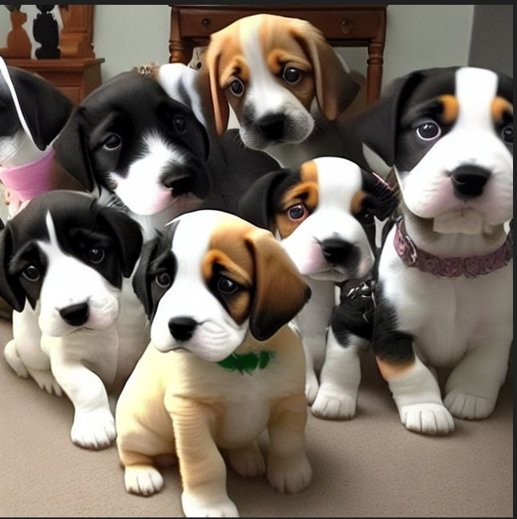
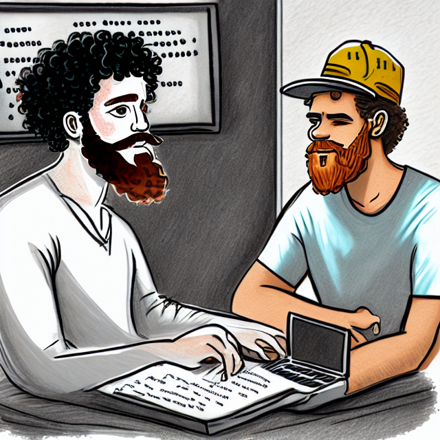

# Python Generative AI text-to-image

This project uses the Hugging face stable diffusion pipeline  to generate images from text. The code is based on the [Hugging Face Transformer](https://huggingface.co/docs/diffusers/en/api/pipelines/stable_diffusion/overview). It allows the user to input text and receive an output in the form of an image. This project was practice for me in learning how to build text to image generation models.

---

## Examples


`prompt = "a puppy cult that worships puppy the streamer"`



---

`prompt = "a brazilian man with short curly hair drawing and a white man with a black beany hat on and a red beard who is coding"`



---

## Required packages

```

conda install diffusers
conda install transformers accelerate

```
---